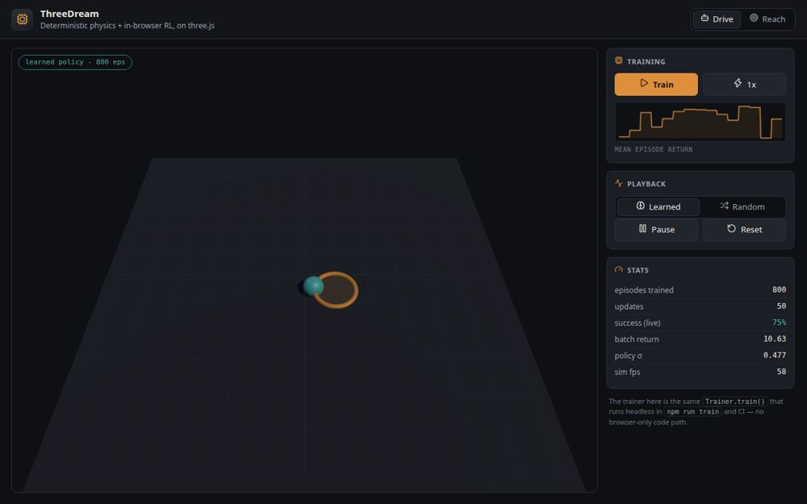

# ThreeDream

A game and physics-AI kernel that runs in the browser: a deterministic ECS with a
fixed-timestep simulation loop, a pluggable physics layer, and a reinforcement
learner that trains live in the page. Rendering is three.js, but the simulation
itself needs no browser, no GPU, and no WebAssembly.

一个跑在浏览器里的游戏与物理-AI 内核：确定性 ECS + 固定步长仿真循环、可插拔的物理
层，以及在页面里实时训练的强化学习器。渲染用 three.js，但仿真本身不依赖浏览器、GPU
或 WebAssembly。

[](https://github.com/flowinginthewind700/threedream/actions/workflows/ci.yml)



Live demo: <https://flowinginthewind700.github.io/threedream/>, deployed from
`main` automatically once every gate in CI is green.

在线演示：<https://flowinginthewind700.github.io/threedream/>，`main` 上所有 CI 关卡
通过后自动部署。

## Quickstart

```bash
npm install
npm run dev       # browser demo on http://localhost:5173
npm run train     # headless training in Node, prints a progress trace
npm test          # 251 unit tests, ~18s
npm run verify    # typecheck + test + build
```

Requires Node >= 22.12.

The demo trains in the page. Press **Train**, watch the mean episode return climb
on the sparkline, then flip **Playback** from `Random` to `Learned` to see what it
learned. The viewport badge tracks how many episodes the current policy has behind
it. **Reach** is the harder of the two tasks.

演示页里直接训练。点 **Train**，看火花线上 mean episode return 上升，再把
**Playback** 从 `Random` 切到 `Learned`，就能看到它学到了什么。视口角标记录当前策略
背后有多少 episode。**Reach** 是两个任务里更难的那个。

## Why it is shaped this way

Two rules drive the design:

1. **The simulation is the only source of truth.** The renderer mirrors physics
   state into `THREE.Object3D`s each frame and never writes back. The same scene
   therefore runs headless for training and rendered for play, with identical
   results.
2. **Everything that matters is deterministic.** A seeded RNG, a fixed timestep,
   and no hidden global state mean `engine.step(n)` in Node and `engine.frame(dt)`
   in a browser produce the same simulation. That is what makes a physics-AI
   kernel testable: all 251 tests run without a GPU.

两条规则决定了整体设计：

1. **仿真是唯一事实来源。** 渲染层每帧把物理状态镜像到 `THREE.Object3D`，从不回写。
   于是同一个场景既能无头训练，也能在浏览器里渲染游玩，结果完全一致。
2. **关键路径都是确定性的。** 带种子的 RNG、固定步长、没有隐藏的全局状态，所以 Node
   里的 `engine.step(n)` 与浏览器里的 `engine.frame(dt)` 跑的是同一个仿真。这让一个
   物理-AI 内核变得可测：251 个测试全都不需要 GPU。

## Layers

```
core     clock / ECS / events / engine facade     no three.js, no WASM
physics  backend interface + two solvers          no three.js
ai       MLP, Gaussian policy, policy-gradient    no three.js, no WASM
envs     learning tasks (drive, reach)            physics only
render   three.js bridge                          the only layer importing three
```

`src/index.ts` re-exports everything **except** `render` and `physics/rapier`.
Importing the barrel must not pull three.js or WASM into a training script, so
browser code imports those two directly. Deliberate constraint, not an oversight.

`src/index.ts` 重导出**除** `render` 与 `physics/rapier` **之外**的全部内容。引入这个
入口不能把 three.js 或 WASM 带进训练脚本，所以浏览器代码单独直接引这两个。这是刻意的
约束，不是遗漏。

### Physics backends

Both implement `PhysicsBackend`, so envs and the trainer stay agnostic:

| Backend | File | Notes |
|---|---|---|
| `builtin` | `src/physics/builtin.ts` | Pure TS, deterministic, zero dependencies. Default. |
| `rapier` | `src/physics/rapier.ts` | Rapier WASM. Same interface, ~3% off steady-state speeds. |

Swapping backends has caught real bugs: Rapier's `RigidBodyDesc.setAdditionalMass`
is lazy, folded in only at the next `world.step()`, so a first-frame impulse used
to land on a body roughly 400x too light. `tests/rapier_backend.test.ts` pins both
the impulse-on-first-step behaviour and the cross-backend agreement.

两个后端都实现 `PhysicsBackend`，因此 env 与 trainer 与之无关：

| 后端 | 文件 | 说明 |
|---|---|---|
| `builtin` | `src/physics/builtin.ts` | 纯 TS、确定性、零依赖。默认。 |
| `rapier` | `src/physics/rapier.ts` | Rapier WASM。接口相同，稳态速度差约 3%。 |

换后端真抓到过 bug：Rapier 的 `RigidBodyDesc.setAdditionalMass` 是惰性的，要到下一次
`world.step()` 才生效，于是第一帧的冲量曾经打在一个轻了约 400 倍的刚体上。
`tests/rapier_backend.test.ts` 钉死了「首帧冲量」行为和两个后端的一致性。

### The learner

`src/ai/trainer.ts` is a batched policy-gradient method with GAE advantages and a
learned critic. Deliberately not PPO: no importance ratios, no replay buffer, so
the whole update is readable end to end while still being a real policy-gradient
method. Its header comment records three design decisions that were each forced by
a measured failure, because those failures are silent: entropy stays healthy,
training returns look plausible, and greedy evaluation simply never improves.

`src/ai/trainer.ts` 是带 GAE 优势估计与学习式 critic 的批量策略梯度方法。刻意不做
PPO：没有重要性采样比，也没有 replay buffer，整个更新过程可以从头读到尾，同时仍然是
一个真正的策略梯度方法。文件头注释记录了三个「各自被一次实测失败逼出来」的设计决定，
因为这类失败是无声的：熵保持健康、训练回报看着合理，但贪婪评估就是不涨。

Environments follow a gymnasium-style contract (`reset` -> `step` -> `observe`)
over typed fixed-size buffers, because allocation inside a training loop starts to
dominate cost once episodes run in the thousands.

环境遵循 gymnasium 风格的契约（`reset` -> `step` -> `observe`），使用带类型的定长缓冲
区，因为一旦 episode 上千，训练循环里的内存分配就开始主导开销。

| Env | Task | Obs | Act |
|---|---|---|---|
| `DriveEnv` | Steer a body to a randomised goal under real dynamics | 6 | 2 |
| `ReachEnv` | Push a puck into a goal through contact | 14 | 2 |

`ReachEnv`'s 14 observations are 6 planar positions (agent / puck / goal), 4 unit
direction vectors (agent->puck, puck->goal) and 4 planar velocities. Contact tasks
are second-order: knowing where the puck is without knowing which way it is already
sliding leaves the policy a step behind. Positions are normalised by arena size so
the policy transfers across scales.

`ReachEnv` 的 14 维观测是 6 个平面位置（agent / puck / goal）、4 个单位方向向量
（agent->puck、puck->goal）和 4 个平面速度。接触类任务是二阶的：只知道 puck 在哪而不
知道它正往哪滑，策略就永远慢一拍。位置按场地尺寸归一化，所以策略能跨尺度迁移。

## Headless training

```bash
npm run train
npm run train -- --episodes 4000 --seed 3 --out artifacts/policy.json
npm run train -- --help
```

Flags: `--episodes N` `--seed N` `--lr N` `--batch N` `--hidden a,b` `--every N`
`--out PATH`. The script trains `ReachEnv`; the same loop drives the browser demo,
so a policy that trains here plays there.

参数：`--episodes N` `--seed N` `--lr N` `--batch N` `--hidden a,b` `--every N`
`--out PATH`。该脚本训练 `ReachEnv`；同一个循环也在驱动浏览器演示，所以这里训练出来
的策略就能在那里玩。

## Writing your own task

```ts
import { createEngine, createBuiltinPhysics, vec3 } from './src/index.js';

const physics = createBuiltinPhysics({ gravity: vec3(0, -9.81, 0) });
const engine = createEngine({ physics });

engine.addGround();
const box = physics.createBody({
  shape: { kind: 'box', halfExtents: vec3(0.25, 0.25, 0.25) },
  position: vec3(0, 3, 0),
  mass: 1,
  restitution: 0.3,
});

engine.step(120); // two seconds at 60 Hz
console.log(physics.getBodyState(box)!.position); // -> [0, 0.246, 0]
```

Implement `LearningEnvironment` over such a world and the trainer learns it with no
changes. `src/envs/drive.ts` is the shortest useful example.

在这样的世界上实现 `LearningEnvironment`，trainer 无需任何改动就能学它。
`src/envs/drive.ts` 是最短且有用的示例。

## Testing and CI

The project is developed test-first: a spec exists for every module under `src/`,
and `tests/tdd.test.ts` fails the build the moment a new module lands without one.

| Command | What it runs | Cost |
|---|---|---|
| `npm test` | 251 unit tests, headless, no GPU/WASM | ~18s |
| `npm run test:coverage` | same suite under v8, floor enforced by `vitest.config.ts` | ~4s |
| `npm run test:e2e` | Playwright spec for `render/` against a real (software GL) browser | ~30s |

Coverage is a separate command, not a flag on `npm test`: instrumenting the
training inner loop costs ~10x wall time, and folding that into the fast loop
would destroy the red/green cadence the tests exist to provide. So the coverage
run skips the two convergence tests (`COVERAGE=1`, `tests/trainer.test.ts`) that
cost 180s of the 185s and contribute ~0.3% of branch coverage — `npm test` still
runs them, and `tests/tdd.test.ts` pins that asymmetry. The floor sits a few
points under what the suite actually measures (93/82 against 97/87), which is
the part that matters — a threshold set far below current reality is decoration,
while one set at it makes every refactor a fight.

`.github/workflows/ci.yml` is one file with four jobs: `verify` (typecheck +
tests + build), `coverage`, and `e2e` run in parallel as gates, and `deploy`
depends on all three. A separate `pages.yml` would deploy `main` even when a gate
is red, because Actions cannot express `needs:` across workflow files — so the
dependency lives in one graph, and `tests/ci_workflow.test.ts` pins it (along with
the SHA-pinning of every action and the fact that gate jobs hold no publish
permission). On a green push to `main`, `deploy` builds with the Pages base path
and publishes `dist/`.

本项目采用测试先行：`src/` 下每个模块都有对应 spec，一旦出现没有测试的新模块，
`tests/tdd.test.ts` 会让构建失败。

覆盖率是独立命令而非 `npm test` 的参数：给训练内层循环插桩会让墙钟时间涨约 10 倍，
把它塞进快速循环会毁掉测试本该提供的红/绿节奏。因此覆盖率运行会跳过那两个收敛测试
（`COVERAGE=1`，`tests/trainer.test.ts`）—— 它们占了 185s 里的 180s，却只贡献约 0.3%
的分支覆盖率；`npm test` 照跑不误，这条不对称由 `tests/tdd.test.ts` 钉死。
下限压在实测值之下几个点（实测 97 / 87，下限 93 / 82）—— 这才是关键：远低于现状的
阈值只是装饰，而贴着现状设阈值则会让每次重构都变成搏斗。

`.github/workflows/ci.yml` 是单文件四任务：`verify`（类型检查 + 测试 + 构建）、
`coverage`、`e2e` 三个关卡并行，`deploy` 依赖这三者。单独的 `pages.yml` 会在关卡变红时
仍然部署 `main`，因为 Actions 无法跨工作流文件表达 `needs:`，所以依赖关系收敛在一个图里，
并由 `tests/ci_workflow.test.ts` 钉死（连同每个 action 的 SHA 锁定、以及关卡任务不持有发布
权限这一事实）。`main` 上一次绿色 push 后，`deploy` 用 Pages base 路径构建并发布 `dist/`。

## Unreal Engine reference (opt-in)

Current feasibility study: [Rust + wasm + WebGPU + three.js](docs/feasibility-rust-wasm-webgpu.md).

`thirdparty/UnrealEngine` is a git submodule pointing at Epic's **private**
repository, kept as an architecture reference to read rather than to build
against. The repo stores only the gitlink; no Unreal source is committed.

Cloning this project leaves that path empty. Fetching it requires a GitHub account
that has accepted Epic's EULA and been granted access:

```bash
bash scripts/clone_unreal_reference.sh          # branch: release (default)
bash scripts/clone_unreal_reference.sh 5.5      # or another branch
```

It is a multi-GB shallow clone and the script retries transient network errors.
Nothing in `src/`, `tests/` or the demo depends on it, so a plain
`npm install && npm test` works without it.

`thirdparty/UnrealEngine` 是一个指向 Epic **私有**仓库的 git submodule，留作供阅读的
架构参考，不参与构建。仓库里只存 gitlink，**不提交任何 Unreal 源码**。

当前可行性调研：[Rust + wasm + WebGPU + three.js](docs/feasibility-rust-wasm-webgpu.md)。

克隆本项目后该目录是空的。拉取它需要一个已接受 Epic EULA 并获得访问权限的 GitHub
账号（命令同上）。这是一次数 GB 的浅克隆，脚本会对瞬时网络错误重试。`src/`、`tests/`
和演示都不依赖它，所以直接 `npm install && npm test` 就能跑通。

## Layout

```
src/core/      clock.ts ecs.ts engine.ts events.ts rng.ts
src/physics/   types.ts builtin.ts rapier.ts components.ts
src/ai/        mlp.ts policy.ts trainer.ts baseline.ts
src/envs/      types.ts drive.ts reach.ts
src/render/    scene.ts
scripts/       train_headless.ts clone_unreal_reference.sh
docs/          feasibility study and demo assets
demo/          index.html main.ts styles.css
tests/         15 files, 251 tests
e2e/           Playwright spec for render/ (WebGL, browser-only)
.github/       ci.yml: three gates (verify / coverage / e2e) then Pages deploy
thirdparty/    UnrealEngine (submodule, opt-in)
```

## License

MIT. See [LICENSE](LICENSE).

MIT，见 [LICENSE](LICENSE)。
